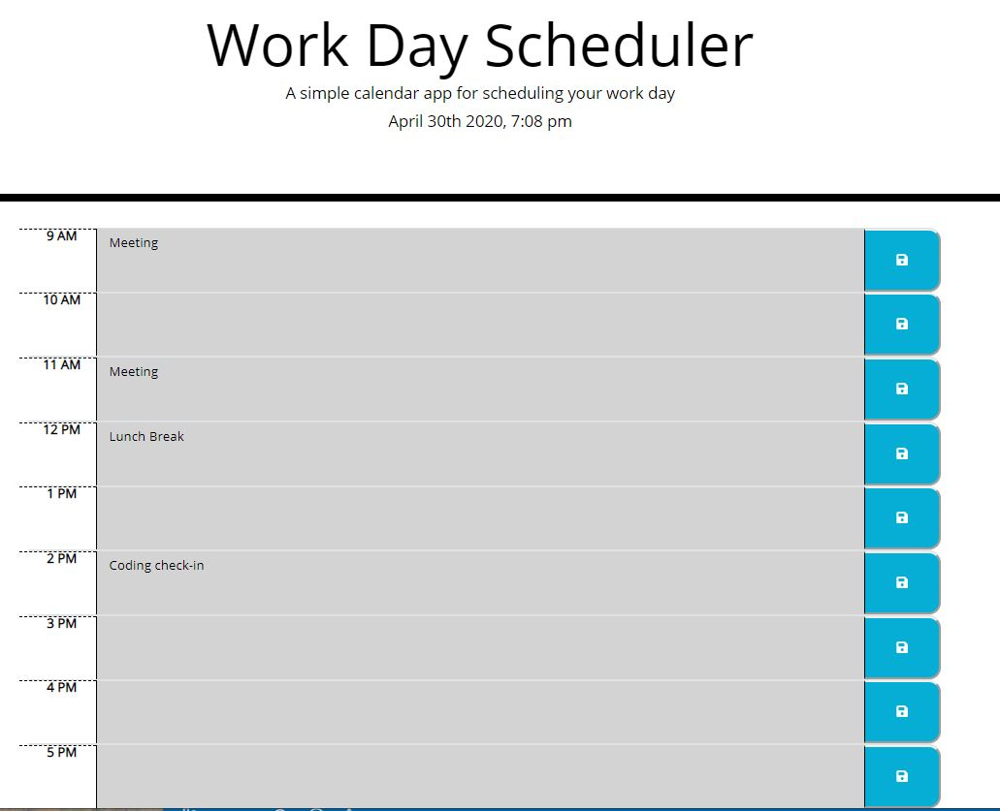
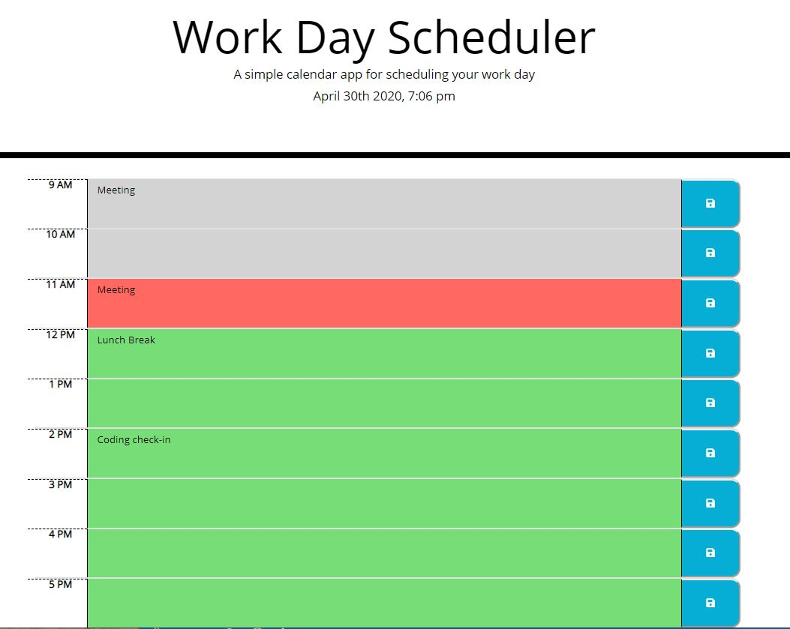

# WorkDayScheduler

## User Story

```
AS AN employee with a busy schedule
I WANT to add important events to a daily planner
SO THAT I can manage my time effectively
```

[Deployed link of scheduler](https://linneagear.github.io/WorkDayScheduler/)


Scheduler at the current time:



Scheduler when set with a preset time, to show past, present, and future classes:

